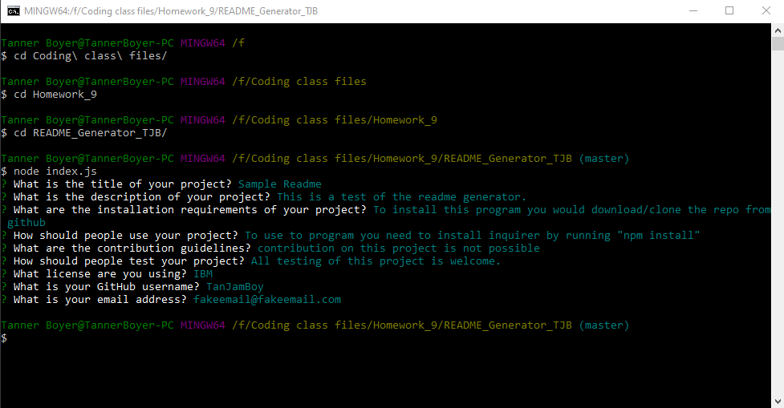

# README_Generator_TJB



Video of application demo: [https://drive.google.com/file/d/1Yi-wnFPmyDPadTykmc3OKNogCOCVKcxR/view](https://drive.google.com/file/d/1Yi-wnFPmyDPadTykmc3OKNogCOCVKcxR/view)

Sample of finished readme using this generator: [Sample](README_SAMPLE.md)

## Description
```
This project is a command line application that easily creates a readme.md for you.  The appliccation will ask for the user using inquirer
to answer a few short prompts on things like title, description, installation requirements, etc.  It will take the user's input and create
a correctly styled readme file.
```

---
## Installation Instructions
To use this program you would be required to download/clone the repo.  When you have the files you need to run "npm install" to install the inquirer dependencies.

---
## Questions
For any add questions contact me here:

GitHub: [TanJamBoy](https://github.com/TanJamBoy)

Email: [tannerjboyer@gmail.com](tannerjboyer@gmail.com)

---